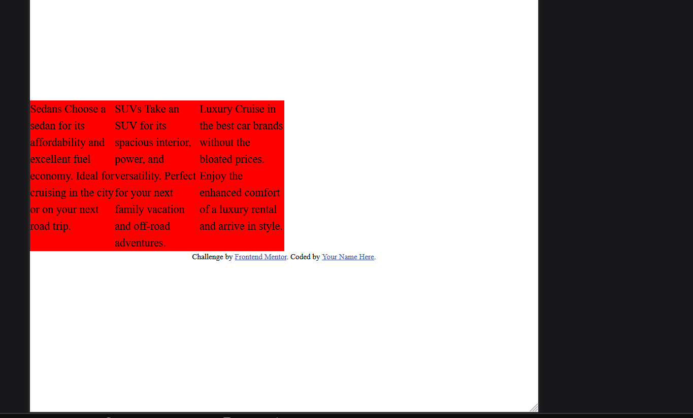
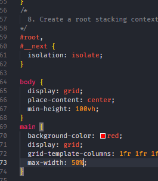

for some reason max-width:50% puts the grid in the left side>?

## IF i put a max height on the main container, it wont be able to hold elements taht a re bigger than its max height, ya3ny law nzlt el button ta7t aktr, and i put maxheight on main, el button hytl3 bara el shasha

- section {
  padding: 3rem;
  /_ here the section is essentially trhe container inside each card, and so adding padding to it will squish it together _/
  display: grid;
  }

# How i aligned the button to the bottom

https://stackoverflow.com/questions/31000885/align-an-element-to-bottom-with-flexbox

# overflow: hidden;

This fixes the issue of border-radius not applying for some reason
